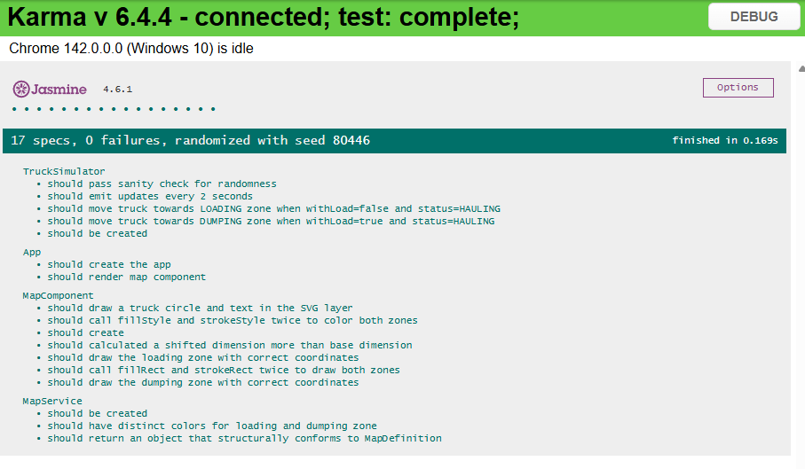

# Coding Challenge - Mine Site Truck Tracking System

This project was generated using [Angular CLI](https://github.com/angular/angular-cli) version 20.3.10.

## Overview

This project is made to showcase software development process, structure and technical solutioning.

## Software Development Process

This project was constructed with unit testing covering all critical requirements.

It follows three guiding patterns:

1. Semantic HTML
2. Smart and dumb component architecture
3. Separation of concerns

## Structure

The project is structured according to three categories, each following a distinct responsibility:

1. Map Definition (map-definition, map-service, mock-map-definition) - responsible for defining the contents of the map ("what to render").
2. Map View (map-component) - responsible for how the map is rendered ("how to render").
3. Truck Simulator (truck-simulator-service) - responsible for pushing real-time updates to the map ("when and what to render").

## Technical Solutioning

This project uses what is known as a clipping margin.

The clipping margin is a technical solution to the clipping problem.

The clipping problem happens when objects are not rendered fully ("clipped") when positioned at the edges of the map.

The clipping margin expands the original dimensions of the map to allow the clipped objects to render fully.

## Unit Testing Scenarios and Results

